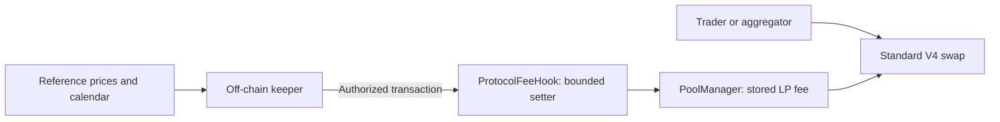

# Fables-informed dynamic LP fees

This work independently implements keeper-updated LP fees in StableLaunchpad. The hook only authorizes bounded writes to Uniswap's native stored LP fee; price and calendar decisions live off-chain. It does not integrate custody with Fables, copy its unlicensed code, reproduce its unpublished keeper, or promise its advertised returns. Source support is not a live deployment.

## Research conclusion

Fables' current shared crypto hook does **not** calculate volatility on chain. `FablesRamp` returns a configured flat autonomous fee. Authorized off-chain software can replace either swap direction's fee temporarily. The source explicitly says its earlier Parkinson tick-range volatility estimator was removed because it saturated for memecoins and could not observe external-price adverse selection for liquid assets.

The shared equity hook adds a calendar model: market-session, overnight and closed-session rates, an opening descent and a closing ramp/hold. It can therefore increase compensation before predictable equity price-discovery events without waiting for an observed pool price jump. The configured session fees need not increase from open to closed: Fables' own calibration sometimes charges more while the reference market is trading. “Raise fees on weekends” is not a complete description.

The newer resolver adds a persistent directional premium, permits a bounded expiring override for each direction, and enforces the discount floor again at execution. Older hooks differ: the inspected NVDA and ETH hooks have a single symmetric override and measure their half-autonomous floor before the final cap. Treating every deployed Fables hook as the newest shared implementation is incorrect.

Primary evidence and full formulas:

- [Contract research](research/fables/contracts.md): source versions, addresses, exact formulas, calendar quirks, licensing and keeper limitations.
- [Economic research](research/fables/economics.md): dated metrics, fee accounting, incentives, return benchmarks and evidence limits.
- [Pinned mainnet state](research/fables/chain-snapshot.json): all 37 active pools at block 68,544,700, directional fee reads, configuration, overrides, treasury rates and selected AccessManager permissions. Failed newer-ABI probes on older hooks are preserved, alongside successful legacy getter reads.
- [Normalized daily observations](research/fables/metrics.csv): August 18–September 21, 2026; September 21 may be partial/revisable.

At the pinned block, UBIK/USDG's flat baseline was 15,000 pips, with a live override of 15,000/22,500 pips, a 3,750-pip floor and 50,000-pip cap. SPCX/USDG's shared RWA configuration was `(2000,500,500,5,3000,1800,2000,1800,1800)` in Fables' own tuple order; both current directions read 500 pips. Those are measured examples, **not recommended StableLaunchpad settings**. The observed keeper could call the shared hooks' poke selector immediately, but could not call clear/config selectors. These reads do not enumerate all administrators or establish every administrator's execution delay.

September 20 API estimates were $146,458 gross swap fees on $70,627,552 chosen-leg volume, approximately 20.74 basis points. The trailing-seven-day fee/volume proxy was 19.72 basis points. These are aggregate estimates, not realized position returns. The adapter hardcodes zero protocol revenue even though the pinned on-chain treasury getters returned 10% for most pools and 0% for ETH/USDG, GLD/USDG and SPY/USDG. Its gross-fee estimates must not be described as net LP income.

The advertised “up to 2.1x more yield on identical risk” has no reproducible supporting benchmark in the public materials inspected. High aggregate fee income does not establish this causal claim. Fee changes alter order flow and inventory, so replaying fixed historical volume under a higher fee does not prove higher net profit.

## Fit with existing strategies

The branch is based on `main` at `57db3d0`, the tree that records the 2026-09-21 production release. The deployed `ProtocolFeeHook` implementation (`0xd4AC6b17…`) is the `afterSwap`-charging hook with the 1% skim ceiling and one-hour increase delay described in the open KyberSwap pull request; this work adds to that contract without changing any of it. The per-swap `IDynamicFeePolicy`/`VolatilityFeePolicy` consultation that `main` had staged for the skim was never deployed and is removed here rather than kept beside the keeper: one mechanism, on the LP fee, keeps the skim exactly as integrators were told it behaves.

This implementation changes **the price of taking liquidity**, not its ownership or range:

- The reserve's Morpho or sUSDai strategy still earns yield on backing. The fee keeper cannot select a reserve, borrow funds or move collateral.
- `BrandFeeVault` and `LpRewardDistributor` keep their existing float-yield accounting. Dynamic LP fees enter Uniswap fee growth, not the reserve's yield balance.
- The existing `ProtocolFeeHook` skim remains separate: charged on the unspecified leg in `afterSwap`, capped at `MAX_FEE_PIPS` (1%), increases announced one hour ahead. A 1% LP fee plus a 0.1% skim is not simply the same as a 1.1% LP fee.
- Existing full-range positions remain full range. `LpRewardDistributor`'s concentrated-position staking and the managed liquidity vaults on `main` are untouched; a dynamic pool is an ordinary v4 pool to them.
- A future concentrated or managed position can use the same dynamic pool key. It still needs its own inventory, rebalancing, valuation and reward-allocation safeguards.
- For dynamic pools, quote logic reads the current `slot0.lpFee`: `MarketLens` through `V4SwapSimulator`, the frontend and backend through the PoolManager storage reader, aggregators through StateView. `PoolKey.fee` remains an identity flag, not the execution rate. Both swap directions use the same stored fee.

The older liquidity research's recommendation to derive volatility from the pool's own observations is not adopted here. The observation ring remains the platform oracle, but an independent reference is required for the optional divergence keeper. Also, the older statement that a 1.00% yield floor “covers” 1.8% annualized LVR is arithmetically false; those illustrative numbers do not justify profitability.

## Minimal on-chain architecture

`AssetMarketFactory.tickSpacingForFee` accepts the exact Uniswap dynamic marker `0x800000`, assigning spacing 50. Static tiers and pool identities remain unchanged. Only new pools can opt in: the fee field is part of the immutable pool ID.

`ProtocolFeeHook` retains its existing `0x00CC` permissions, protocol skim and observation writes. It does not return an LP-fee override from `beforeSwap`, call an oracle or policy contract during swaps, or calculate any calendar/pricing rules. Uniswap uses its own stored LP fee.

- `setFeeKeeper(address)` is owner-only; the zero address revokes keeper access.
- `setPoolLpFee(PoolKey,uint24)` is callable by the owner or authorized keeper. It requires this hook, a registered pool and the exact dynamic flag.
- The contract enforces 100–50,000 pips, inclusive: 0.01–5%. This bounds only the LP fee; the existing protocol skim is separate.
- Updates call `PoolManager.updateDynamicLPFee` and emit `PoolLpFeeUpdated`. The same fee applies to both directions, including exact-output trades.
- Registration initializes a dynamic pool's stored fee to 5,000 pips (0.50%) within the factory creation transaction.
- Only `feeKeeper` is appended, below the deployed `pendingFeePipsOf`/`feePipsEffectiveAt` slots. No policy address, per-pool policy switch or transient sampled-rate slot exists.

There is no on-chain expiry, fallback fee, half-baseline floor, per-pool policy delay or directional premium. A fee persists until another authorized update. Revoking the keeper stops future writes but does not reset the last fee. Existing UUPS owner authority remains unchanged. A fee-only keeper cannot withdraw assets or upgrade the hook, but harmful fee choices can still damage LP returns and cause stale quotes to revert.

## Off-chain decisions and consumers

The [keeper](FABLES_KEEPER.md) calculates a flat or equity-session baseline, optionally adds a bounded premium based on absolute divergence from an independently configured V3 reference, and submits one symmetric fee. All calendar dates, lookbacks, economic calibration and optional lower pool caps are off-chain operator inputs, not extra on-chain authority checks.

The keeper defaults to plan-only. With no reference configured, flat/calendar updates can still run. With a reference configured but invalid, it refuses new writes; it does not silently substitute another strategy. The previous fee remains in effect, so scheduling and failure alerting matter.

The canonical/shared readers and maintained clients expose one optional `lpFee` observation for dynamic pools, reusing the existing PoolManager slot0 read; the keeper uses `StateView.getSlot0`. Unreadable dynamic data is unavailable, not zero or the marker interpreted as a percentage. The ordinary V4 Quoter executes the same stored-fee path as a trade.

Aggregator submission preparation and upstream adapter changes are deferred at the user's request. Existing application packets are not evidence of support for the new pools. A dynamic-aware consumer must track the stored fee and preserve existing protocol-skim accounting. Prices and fees may change before inclusion; retain swap output/input limits.

## Rollout and operating procedure

No live transactions, secret-file changes, commits or application submissions are part of this work.

1. Review the [research](research/fables/contracts.md), [security notes](FABLES_SECURITY_REVIEW.md) and current [verification](FABLES_VERIFICATION.md). Choose calibration deliberately; Fables' observed rates and our defaults are not recommendations.
2. Rehearse the hook/factory upgrade on a recent fork, preserving proxy storage and the mined hook address. Check deployed bytecode sizes and existing upgrade governance.
3. Deploy dynamic-aware readers and clients before listing dynamic pools. Coordinate aggregator support separately; do not silently convert existing static pools.
4. Create a new dynamic market. Verify its initial 0.50% stored fee, liquidity, mint/redeem capacity, quote/execution agreement and treasury separation.
5. Authorize a gas-funded fee-only keeper, run plans first, then enable explicit execution. Schedule it externally and serialize runs per pool. An authorized owner remains able to correct a fee and revoke the keeper.
6. Alert on missed/failed updates, calendar maintenance gaps and invalid reference data. Last-written fees do not expire. Emergency correction requires a transaction.
7. Measure net marked LP performance against holding and a suitable rebalancing benchmark. Separate inventory, fees, reserve yield, protocol revenue, gas and incentives; do not infer profit from gross fees alone.

Production activation remains a governance decision. Tests establish behavior, not profitable calibration, reliable external prices or guaranteed returns.
