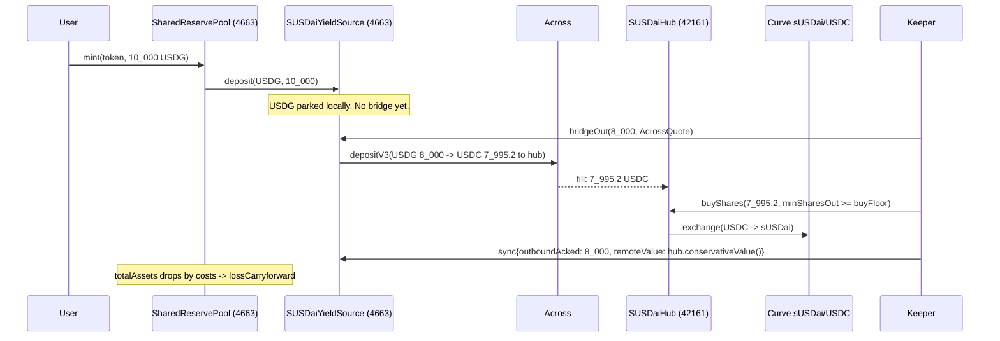
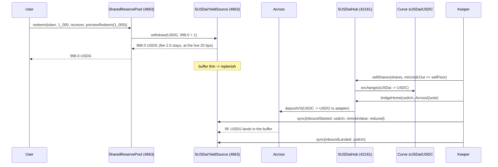

# sUSDai collateral — the cross-chain reserve group

**Status, re-read from chain on 2026-09-20 at block 68,293,146.** This is **live on Robinhood
Chain mainnet**, and it is the reserve every live market draws on. An earlier version of this
line said the production topology "is not deployed"; that has not been true since the gen-6
deploy.

| | |
|---|---|
| `SharedReservePool` (sUSDai group) | `0xCFa888f6F124452fDe0C7348328A7c73A8fd33B2` |
| `SUSDaiYieldSource` | `0x460f319E43428387bff58ec262C992Ec7DA22fDc` |
| `SUSDaiHub` (Arbitrum) | `0x740ddd200D9Ee605F25239Ba701bdd89161034b1` |
| Keeper | `0x467Ca912943e85A0B0e72B7E1190129762481EEC` |
| `ProtocolGuard` | `0x013D1974F8215a12280e6b9a33F9732277F38C0e`, not paused |
| Owner of pool, adapter and every other handle on 4663 | Gnosis Safe `0x28569c1716EF81f307d666A1EC08bDAE92AC0373`, v1.4.1, 2-of-3 |
| `redemptionFeeBps` | **20**, with no increase pending |
| `liabilityCap` | 10,000,000 USDG |
| `totalAssets` / redeemable | ~35,276 USDG, ~9.96M USDG of mint headroom |
| Registered brands | 31 |

**The cross-chain half has not been exercised yet.** `remoteValue` is 0,
`remoteValueUpdatedAt` is unset, and both in-flight counters are 0: the entire position sits as
USDG in the adapter's local buffer, so today the group is a 1:1 USDG reserve with a 20 bps exit
fee and the bridge machinery below is armed but idle. Read that as the honest current state,
not as a claim that the loop has run in production.

The Base Sepolia and Arbitrum Sepolia integration stack is separate and still there: source
hashes, transaction receipts, a controlled Across round trip and final accounting are recorded
in [`deployments/asset-markets-base-sepolia.json`](../deployments/asset-markets-base-sepolia.json).
`deployments/mainnet-state.json` is generated from chain state and is the authority for every
address and parameter above.

## 1. What it is

A second `SharedReservePool` on Robinhood Chain — "the sUSDai group" — whose `IYieldSource` is
not a lending market on this chain but a position on Arbitrum: USD.AI's sUSDai, held by a hub
contract there and reached through Across. Everything a reader of
[SHARED_RESERVE_POOL.md](../SHARED_RESERVE_POOL.md) already knows still holds: brands register
permissionlessly, mint is 1:1 in USDG, brand tokens swap 1:1 with each other, yield goes to brand
treasuries on a cumulative index, and redemption is never pausable. What changes is what the pool
sees behind `yieldSource.balanceOf(USDG)`: instead of Morpho shares it is a USDG buffer on this
chain plus three counters a keeper maintains — USDG in flight out, USDC in flight back, and the
hub's conservatively marked holdings. The bridge and swap costs of moving backing across show up
as `lossCarryforward`; a redemption fee (live at **20 bps**, capped at 100) is what repays them; NAV
growth beyond that is yield to the brands exactly as before.

This is a deliberate narrowing of the research document that preceded it. (That document is not
in this repository, which is contracts and tests only; the section numbers below refer to it.)
Its executive decision is
to keep the *liability* on Arbitrum and bridge our own token to Robinhood (§1). We instead keep
the liability here, where the reserve and every other brand already are, and move only the
*collateral*, because the pool, its ledger, its beacons and its guard already exist on this chain
and a second issuance stack on Arbitrum would duplicate all of it. From §3 we follow the "retail
convenience path": USDG in, bridge to USDC, local tight-bound Curve acquisition, conservative
valuation, deposit-in-progress kept separate from credited backing. From §4 we implement flow B,
the quoted hub market sale, and leave A (market maker), C (native queue) and D (in-kind) for
later. From §7 we keep the mutually exclusive buckets — local, outbound in flight, hub value,
inbound in flight — and its rule that a bridge timeout is a refund to the sender, never equity.
What §3 calls the capital margin is not implemented; the conservative NAV mark and the fee are
the only cushions. See §9 for the full list of deferrals.

## 2. The loop





## 3. Contracts

| Contract | File | Chain | Address | Owner | Keeper rails |
|---|---|---|---|---|---|
| `SharedReservePool` (group proxy) | `src/pool/SharedReservePool.sol` | 4663 | `0xCFa888f6F124452fDe0C7348328A7c73A8fd33B2` | Safe `0x2856…0373` | none |
| `SUSDaiYieldSource` | `src/yield/SUSDaiYieldSource.sol` | 4663 | `0x460f319E43428387bff58ec262C992Ec7DA22fDc` | Safe `0x2856…0373` | `bridgeOut`, `sync` |
| `SUSDaiHub` | `src/susdai/SUSDaiHub.sol` | 42161 | `0x740ddd200D9Ee605F25239Ba701bdd89161034b1` | `HUB_OWNER`, a separate key on Arbitrum: the Safe is on the other chain and cannot act there | `buyShares`, `sellShares`, `bridgeHome` |
| `AcrossBridger` | `src/susdai/AcrossBridger.sol` | both | base contract, not deployed alone | — | — |
| `IAcrossSpokePool`, `ICurveStableSwapNG`, `IStakedUSDai` | `src/interfaces/` | — | the slices of the three external contracts we call | — | — |
| `SUSDaiAddresses` | `script/SUSDaiAddresses.sol` | — | constants for both chains, read back 2026-09-13 | — | — |

**There is no 48-hour timelock.** An earlier version of this table named one,
`0x5f43…872a`, as the owner of the pool and the adapter. Ownership migrated to the 2-of-3 Gnosis
Safe `0x28569c1716EF81f307d666A1EC08bDAE92AC0373` and **nothing replaced the delay**: every
`_authorizeUpgrade` in the stack is a bare `onlyOwner`, so the Safe can upgrade the pool, the
adapter or anything else in the transaction that proposes it. Two of three signers instead of
one hot key is the whole of the improvement. `docs/audit-history.md` carries this as
A3-CRITICAL-1, still open and deliberately accepted.

The live brand-token and treasury beacons from the v4 deployment are reused, so a brand registered
on this pool runs the same `PooledBrandToken`/`PoolBrandTreasury` code as the USDG group and
upgrades with it. The market stack is shared rather than duplicated: one `AssetMarketFactory`,
one `MarketRouter` and one `ProtocolFeeHook` serve every reserve the factory has approved, and a
market records which reserve its brand draws on. **All six live markets (ids 13 to 18) draw on
this reserve**, so this is the shape in production and not a plan. A coin backed by this group
launches with
its pool in one `createMarket` call, the same as a USDG-group coin, and both groups' markets
share one id space. What differs is the peg's cost, not the plumbing: minting here is bounded by
`liabilityCap`, redemption retains `redemptionFeeBps` and is paid out of the local buffer.

## 4. Accounting

**The position identity.** `adapter.balanceOf(USDG)`, which is what `pool.totalAssets()` adds to
its own idle balance, is

```
arrived  = max(0, local − localAtLastSettlement)
inFlight = max(0, outboundExpected + inboundInFlight − arrived)
position = local + inFlight + remoteValue
```

where `local` is `usdg.balanceOf(adapter)` (`SUSDaiYieldSource._position`). Only `local` is a
balance this chain can read. `bridgeOut` moves USDG out of it and into the outbound leg; a
`sync` with `outboundAcked` moves that leg into whatever `remoteValue` the keeper reports;
`inboundStarted` moves value from `remoteValue` into `inboundInFlight`; and `inboundLanded`
retires `inboundInFlight` because the USDG is now, physically, in `local`. The keeper can only
ever *move* value between buckets or *lower* it; raising it is bounded (below).

Two refinements that an earlier and simpler version of this identity — a plain sum of the four
buckets — got wrong, both worth understanding because they are the difference between honest
accounting and free money:

- **The outbound leg is valued at what will arrive, not what was sent.** `outboundExpected`
  accumulates the Across quote's `outputAmount`, while `outboundInFlight` counts the USDG
  escrowed. Valuing the leg at its input would overstate the position by the bridge fee for the
  whole flight and hand the keeper exactly enough growth allowance to never account for that
  fee, which defeats the one thing `lossCarryforward` exists to do. The fee is booked as a cost
  when it is incurred.
- **An unexplained increase in `local` is read as a leg arriving.** An Across fill credits the
  balance the instant a relayer fills it, but the matching counter is only cleared by a later
  `sync`. A plain sum therefore double-counts that leg for a whole keeper tick, the pool credits
  the overstatement to its monotonic yield index, and `claimYield` pays it out with no clawback
  — making a public Across fill free money for anyone watching for it. So `localAtLastSettlement`
  tracks the balance the adapter can account for, and anything above it is netted off the
  in-flight counters first. A genuine donation is recognised one settlement late, which is the
  right way round: understating costs a brand some yield, overstating pays yield out of somebody
  else's principal.

**Costs become `lossCarryforward`, fees repay it.** When the keeper syncs a `remoteValue` that is
lower than the USDG it acknowledges — 8,000 USDG out, 7,995.2 USDC delivered, 7,990 conservative
value after the Curve leg — `totalAssets()` drops, and the pool's next `_accrueGlobal` books the
drop into `lossCarryforward`. No brand sees a negative index; the loss is simply the first thing
future growth must cover. The redemption fee is that growth. From `_redeem`:

```solidity
uint256 fee = amount * redemptionFeeBps / BPS;
uint256 owed = amount - fee;
_recallIfNeeded(owed);
...
_syncAccrualBaseline();
if (fee > 0) {
    // The fee stayed in the reserve. Holding it out of the baseline is what makes the
    // next accrual recognise it as income: it repays `lossCarryforward` first and only
    // then reaches the brands' ledgers, the same path yield takes.
    lastAccrualAssets -= Math.min(lastAccrualAssets, fee);
    emit RedemptionFeeRetained(token, fee);
}
```

The fee is not transferred anywhere. It stays in the reserve, the baseline is lowered by it, and
the next accrual sees `totalAssets() - lastAccrualAssets = fee`, which `_accrueGlobal` applies to
`lossCarryforward` first and only then to `cumulativeYieldPerToken`. Test:
`test_redeem_feeRepaysBookedCostsBeforeItBecomesYield`.

**The growth cap.** A `sync` may set

```
remoteValue' + inboundStarted <= remoteValue
                                + outboundAcked * outboundExpected / outboundInFlight
                                + inboundRefunded
                                + max(remoteValue * maxRemoteGrowthBpsPerDay / 10_000,
                                      maxRemoteGrowthAbsolutePerDay) * elapsed / 1 days
```

or it reverts `RemoteValueAboveCap(reported, allowed)`. Four details, each of which exists
because its absence was a finding:

- The acknowledged outbound is credited at the quote's OUTPUT, pro rata, not at its input — the
  same reason `outboundExpected` exists above.
- `elapsed` is the time since the last sync, **clamped to `MAX_GROWTH_WINDOW` = 7 days**. Without
  the clamp a dormant deployment accumulates enough headroom to double `remoteValue` in one
  report; real yield earned over a longer outage is recognised over successive reports instead,
  which is the point of a rate cap. The first sync gets no growth term at all.
- The per-day allowance takes the **larger** of the bps term and
  `maxRemoteGrowthAbsolutePerDay`. The bps term is proportional to the previous `remoteValue`,
  which makes zero an absorbing state: once a report lands the value at zero, nothing could ever
  raise it again and everything the hub holds would be written off for good. The absolute floor
  is the way back out. `setRemoteValue` (owner, break-glass) is the other.
- Decreases are unbounded. `outboundRefunded` adds nothing to the cap, because that USDG is back
  in the local balance where the pool can already see it. `inboundStarted` is on the left because
  value moving from `remoteValue` into `inboundInFlight` is still value the keeper is asserting
  exists.

At the default 50 bps/day a stolen key can inflate the position by at most 0.5 % per day beyond
what was really bridged, and every wei of that shows up as claimable brand yield, which is the
only thing inflation buys.

**The +1 wei recall.** `SharedReservePool._recallIfNeeded` asks the yield source for
`shortfall + 1`, a habit inherited from Morpho's floor-division rounding. `SUSDaiYieldSource.withdraw`
pays `min(amount, local)`, so after a redemption one wei more than needed sits idle in the pool.
It is not lost: `totalAssets()` counts it, `_syncAccrualBaseline` absorbs it, and the next `mint`
or `deployIdle` sends it back to the adapter. Tests assert on
`adapter.availableLiquidity() + usdg.balanceOf(pool)`, never on the adapter alone.

**The conservative mark and the parity assumption.** `hub.conservativeValue()` is
`sharesHeld * redemptionSharePrice / 1e30 + usdcHeld`, in USDC units: shares are marked at what a
native sUSDai redemption would be serviced at, not the deposit NAV Curve prices them at. The gap
was ~44 bps on 2026-09-13. The keeper reports this number as `remoteValue`, in what the adapter
calls USDG units — that is, USDai, USDC and USDG are all taken at par. Nothing measures that
basis; it is a disclosed assumption, and a USDC/USDG or USDai/USDC depeg is a loss the pool would
only see when the keeper's next sync reports a lower Curve realisation.

**What `previewRedeem` promises and what `minAssetsOut` does.** `previewRedeem(amount)` is
`amount - amount * redemptionFeeBps / 10_000`: the payout when the reserve can deliver in full.
`redeem(token, amount, receiver, minAssetsOut)` burns first, pays `min(owed, idle after recall)`,
and reverts `InsufficientPayout(payout, minimum)` if that is below `minAssetsOut`. A redeemer who
passes `previewRedeem(amount)` gets par-less-fee or nothing.

**The three-argument overload is no longer the lenient one.** It used to accept whatever the
buffer held and book the difference as a shortfall against `lossCarryforward`. It now derives
its own floor — par less the live `redemptionFeeBps`, which is exactly what `previewRedeem`
returns — and reverts `InsufficientPayout` rather than under-paying
(`src/pool/SharedReservePool.sol:508-510`). There is therefore no overload that silently
absorbs a thin buffer any more, and an integrator should still prefer the four-argument form,
because it bounds the payout at a number the caller chose rather than at whatever fee happens to
be live when the transaction lands.

Note for integrators: compute `previewRedeem` into a local before any `vm.prank`/impersonation
in tests, because the prank is consumed by the view call.

## 5. Keeper responsibilities

The keeper is one hot key, `0x467Ca912943e85A0B0e72B7E1190129762481EEC`, set on both contracts,
driven by an off-chain service that lives in the application repository rather than this one.
Every call it makes is bounded on chain (§6); its job is timing and reporting. **It has not run
a production bridge yet:** `remoteValue` is zero and both in-flight counters are zero, so the
sequences below describe armed machinery, not observed mainnet behaviour.

**Mint side (USDG has accumulated in the adapter).**

1. Fetch an Across quote for `amount` USDG → USDC, depositor = adapter, recipient = hub (see the
   API call below).
2. `adapter.bridgeOut(amount, quote)`. Reverts unless the caller is the keeper, the guard has
   not paused the adapter, `maxBridgeAmount != 0 && amount <= maxBridgeAmount`
   (`BridgeAmountAboveCap`), `amount <= local` (`InsufficientLocalBalance`), the rolling window
   still has room (`BridgeBudgetExhausted`),
   `local - amount >= max(position * minLocalBufferBps / 10_000, minLocalBufferAbsolute)`
   (`LocalBufferBreached`), and
   `quote.outputAmount >= amount - amount * maxBridgeFeeBps / 10_000`
   (`BridgeOutputBelowFloor`). Emits `BridgedOut(depositId, amount, outputAmount)`;
   `outboundInFlight += amount` and `outboundExpected += quote.outputAmount`.

   **Both buffer floors matter and the absolute one is the real protection.** The bps floor is
   a share of `_position()`, which includes the keeper-written `remoteValue` — so a keeper that
   reports a low value shrinks its own floor and can then bridge out almost the whole redemption
   buffer. A token figure cannot be moved by any report, and tokens are the unit redemption
   demand is denominated in. Size `minLocalBufferAbsolute` to real flow; zero leaves only the
   bps floor.
3. Wait for the fill: poll `usdc.balanceOf(hub)` on Arbitrum, or watch the Arbitrum SpokePool's
   fill event for `depositId`. Expected fill time was ~2 s when measured.
4. `hub.buyShares(usdcIn, minSharesOut)` with `minSharesOut = max(hub.buyFloor(usdcIn), hub.quoteBuy(usdcIn) * (1 - tolerance))`.
   Reverts `MinOutBelowFloor` if `minSharesOut < buyFloor`.
5. `adapter.sync({remoteValue: hub.conservativeValue(), outboundAcked: amount, outboundRefunded: 0, inboundStarted: 0, inboundLanded: 0, inboundRefunded: 0})`.

**Replenish side (buffer below target, or a redemption reverted `InsufficientPayout`).**

1. Choose `shares` such that `hub.quoteSell(shares)` covers the shortfall.
2. `hub.sellShares(shares, minUsdcOut)` with `minUsdcOut >= hub.sellFloor(shares)`.
3. Fetch an Across quote for `usdcIn` USDC → USDG, depositor = hub, recipient = adapter.
4. `hub.bridgeHome(usdcIn, quote)`. Delivers only USDG, only to `homeReceiver`, only on 4663.
5. `adapter.sync({remoteValue: hub.conservativeValue(), inboundStarted: usdcIn, ...})`. Mind the
   cap here: a sale *raises* `conservativeValue()`, because shares that were marked at the
   redemption NAV become USDC at roughly the deposit NAV — the ~44 bps gap is realised as a
   conservative-terms gain. If `conservativeValue() + usdcIn` exceeds `allowed`, report
   `remoteValue = allowed - usdcIn` (under-reporting is always admissible) and let the next
   periodic syncs catch up as the pro-rata growth term accrues. The keeper service must do this.
6. When the USDG lands (it simply appears in `usdg.balanceOf(adapter)`; there is no callback),
   `adapter.sync({remoteValue: hub.conservativeValue(), inboundLanded: usdcIn, ...})`.

**Periodic NAV sync.** At least daily, and more often than `maxRemoteGrowthBpsPerDay` needs it to
be: `adapter.sync({remoteValue: hub.conservativeValue(), everything else 0})`. sUSDai's NAV rises a
few bps a day and the cap is 50, so a missed day is easily absorbed — but **the allowance stops
accruing at `MAX_GROWTH_WINDOW` = 7 days**, so an outage longer than a week cannot be caught up
in one report and has to be recognised over successive ones. Brands' yield is stale until a
sync lands, and `remoteValueUpdatedAt` is what monitoring watches.

**Refunds.** A deposit nobody fills by `fillDeadline` is refunded by Across's next root bundle,
in the input token, to the depositor, on the origin chain.

- Outbound refund: USDG reappears in `usdg.balanceOf(adapter)`. Sync `outboundRefunded: amount`
  with `remoteValue` unchanged. The cap gives no credit for it; none is needed, the USDG is local.
- Inbound refund: USDC reappears in `usdc.balanceOf(hub)`. Sync `inboundRefunded: usdcIn` and
  `remoteValue: hub.conservativeValue()` (which now includes that USDC again); the cap credits
  `inboundRefunded` so the report is admissible.

**The Across API call.** No key is needed today; Across documents an integrator onboarding
process and the keeper should carry an integrator id once one is issued.

```
GET https://app.across.to/api/swap/approval?tradeType=exactInput&amount=<6dec>&inputToken=<addr>&originChainId=<id>&outputToken=<addr>&destinationChainId=<id>&depositor=<addr>&recipient=<addr>&slippage=0.001
```

| `AcrossQuote` field | Source in the response |
|---|---|
| `outputAmount` | `steps.bridge.outputAmount` |
| `exclusiveRelayer` | abi-decode `swapTx.data` (the SpokePool's `deposit(bytes32,…)`, selector `0xad5425c6`; same twelve words as the `depositV3` our contracts call), arg 8 |
| `quoteTimestamp` | same decode, arg 9 |
| `fillDeadline` | same decode, arg 10 |
| `exclusivityDeadline` | same decode, arg 11 |

The SpokePool rejects a `quoteTimestamp` older than `depositQuoteTimeBuffer()` (3600 s) and a
`fillDeadline` beyond `getCurrentTime() + fillDeadlineBuffer()` (21600 s), so fetch the quote
immediately before sending. Observed cost ~6 bps each way, `expectedFillTime` ~2 s.

## 6. Trust and limits

**Two owners and a keeper.** The Gnosis Safe `0x28569c1716EF81f307d666A1EC08bDAE92AC0373`
(v1.4.1, 2-of-3) owns the pool and the adapter on 4663 and is the only thing that can change a
limit, rotate the keeper, set the fee, or reach for the break-glass calls below. The hub's owner
is a separate key on Arbitrum — the Safe cannot act there, and no cross-chain governance is
wired — and should be a multisig; it can pause the hub, rotate its keeper, change its limits and
`homeReceiver`. The keeper is a hot key with no custody: it can move value between the
protocol's own contracts and report, and nothing else. A third key, the guardian
`0xc1d844d6478e450E62293882d2d6739c4a8693F9`, can pause and cannot resume.

An earlier version of this section described a 48-hour timelock as the owner. **There is no
timelock.** See §3.

**The owner can also replace the code.** The pool, the adapter and the hub are UUPS proxies with
bare `onlyOwner` upgrade authorisation, so every bound in the table below is enforced by an
implementation their owner can swap in one transaction. Read the table as "what the deployed
code enforces against the keeper", not as "what cannot be changed".

**Break glass, owner only.** `adapter.setRemoteValue` overwrites the hub's reported value;
`adapter.resetInFlight` overwrites the two counters; `adapter.seedLocalBaseline` declares the
whole local balance accounted for. None of them grants the owner anything an upgrade would not,
and that is the argument for having them: they turn a 3am recovery into one transaction instead
of a shipped implementation. They exist because `sync` can only raise `remoteValue` from where
it is, so a value reported at zero — by a stolen key, or by an honest keeper reading a collapsed
oracle — would otherwise write the position off with no way back.

| Bound | Contract | Default | Cap | Enforced on | Error |
|---|---|---|---|---|---|
| `maxBridgeFeeBps` | adapter | 20 | 100 (`MAX_BRIDGE_FEE_BPS`) | `bridgeOut` quote floor | `BridgeOutputBelowFloor(outputAmount, floor)` |
| `minLocalBufferBps` | adapter | 1 000 (10 %) | 10 000 | `bridgeOut` | `LocalBufferBreached(remaining, required)` |
| `minLocalBufferAbsolute` | adapter | 0 | none | `bridgeOut`, alongside the bps floor | `LocalBufferBreached` |
| `maxBridgeAmount` | adapter | 0 = disabled | none | one `bridgeOut` | `BridgeAmountAboveCap(amount, maximum)` |
| `bridgeBudgetPerWindow` / `bridgeWindow` | adapter | 0 = disabled | budget <= 2^128−1 | outbound notional per rolling window | `BridgeBudgetExhausted(amount, remaining)` |
| `maxRemoteGrowthBpsPerDay` | adapter | 50 | 10 000 | `sync` | `RemoteValueAboveCap(reported, allowed)` |
| `maxRemoteGrowthAbsolutePerDay` | adapter | 0 | none | `sync`, as a floor under the bps allowance | `RemoteValueAboveCap` |
| `MAX_GROWTH_WINDOW` | adapter | 7 days, constant | — | caps `elapsed` in `sync` | — |
| `maxSwapSlippageBps` | hub | **15** | 500 (`MAX_SWAP_SLIPPAGE_BPS`) | `buyShares`/`sellShares` min-out | `MinOutBelowFloor(minOut, floor)` |
| `maxBridgeFeeBps` | hub | 20 | 100 | `bridgeHome` quote floor | `BridgeOutputBelowFloor` |
| `maxBridgeAmount` | hub | 0 = disabled | none | one `bridgeHome` | `BridgeAmountAboveCap` |
| swap budget / window | hub | 0 = disabled | — | swap and bridge notional per window | `SwapBudgetExhausted(notional, remaining)` |
| share-price band | hub | set at init | — | every NAV read | `SharePriceOutOfBand(price, minWad, maxWad)` |
| `redemptionFeeBps` | pool | **20 live** | 100 (`MAX_REDEMPTION_FEE_BPS`) | every `redeem` | `FeeTooHigh(feeBps, maximum)` on set |

**Both zero-is-disabled defaults are deliberate.** `maxBridgeAmount` and `bridgeBudgetPerWindow`
fail closed, including for a proxy upgraded from an implementation that predates those slots: it
reads zero and stops bridging loudly until the owner sets a budget. A single-deposit ceiling
alone was not enough, because nothing bounded N deposits in one block.

**A raise to `redemptionFeeBps` is announced an hour ahead.** `setRedemptionFee` above the live
value records it as pending and sets `redemptionFeeEffectiveAt` to `FEE_INCREASE_DELAY` (3,600
seconds) out; a permissionless `commitRedemptionFee()` applies it after that, re-checking the
cap. A decrease is immediate and cancels anything pending. `previewRedeem` and both `redeem`
overloads read the LIVE fee and never the pending one, so a quote is good for at least an hour;
`redemptionFeeEffectiveAt() == 0` is the single read that says nothing is scheduled. As with
every other bound here, the owner can upgrade the delay away in one transaction.

**Pause semantics.**

- `ProtocolGuard` `0x013D1974F8215a12280e6b9a33F9732277F38C0e` (the guardian may pause
  instantly and cannot resume; only the owner may unpause) stops
  `pool.mint`, `pool.swap`, `pool.claimYield`, `pool.deployIdle` and `adapter.bridgeOut`. Pausing
  halts new exposure and yield payouts, not exits.
- `pool.redeem` has no pause. Holders can always exit against whatever the buffer holds, and
  `withdraw` on the adapter never reverts.
- `hub.pause()` (hub owner) stops `buyShares`, `sellShares` and `bridgeHome`. Views keep
  answering, so `sync` keeps working: a paused hub must not blind the reserve.

**What a compromised keeper can do.** Bridge USDG to the hub (only the hub) at a quote within
20 bps, subject to the single-deposit ceiling, the rolling window budget and both buffer floors.
Churn USDC and sUSDai through Curve at up to 15 bps below NAV per leg, within the hub's own
window budget. Bridge USDC home (only to the adapter). Overstate `remoteValue` by up to 50 bps
per day, or by `maxRemoteGrowthAbsolutePerDay` if that is larger, which lets brand treasuries
claim yield that does not exist at that rate. Refuse to act, which leaves the buffer to drain
and redemptions to revert.

**What it cannot do.** Send any token anywhere but the two protocol contracts. Take a quote below
the fee floor. Sell below the NAV floor. Invent backing faster than the cap. Change a limit, the
fee, or its own successor. Stop a redemption.

## 7. Measured numbers (2026-09-13)

| Quantity | Value |
|---|---|
| Across USDG(4663) → USDC(42161), $10k | 9,993.99 out: ~6 bps |
| Across USDC(42161) → USDG(4663) | ~6 bps |
| Curve `get_dy(USDC→sUSDai, 10_000e6)` | 8,990.84 sUSDai (8,990.80 in the deploy dry run) |
| Curve `get_dy(sUSDai→USDC, 9_000e18)` | 10,007.61 USDC |
| Fork probe, same block | 10,000 USDC → 8,990.81 sUSDai → sell → 9,998.000002 USDC: **2 bps round trip** |
| `conservativeValue()` right after that buy | 9,954.76 USDC (deposit NAV 1.112174e18, redemption NAV 1.107215e18: **~44 bps gap**) |

So a full USDG → USDC → sUSDai → USDC → USDG round trip measured 6 + 2 + 6 = 14 bps on that
date. **The live fee is 20 bps, not 14.** The extra 6 bps is headroom over a measurement taken
once, on one day, at one size, on a route with two bridge legs whose cost is a relayer's quote
rather than a constant. It is still cost recovery rather than a margin: every redemption pays
roughly the friction it will eventually cause, and the pool's accounting nets the two toward
zero over time — an over-recovery simply lands in `cumulativeYieldPerToken` and goes to the
brands, exactly as yield does. Re-measure before treating 14 as the number the fee should track.

The 44 bps NAV
gap is *not* charged — it is a valuation haircut the pool carries as `lossCarryforward` from the
first sync, is repaid by sUSDai's own NAV growth as the keeper syncs it, and would be
realised only if the position had to exit through the native queue. Raising the fee toward the
100 bps cap to cover it would make every redeemer pay for a loss that is not expected to happen.

## 8. Runbook

### Base Sepolia integration deployment

The deployed test topology uses `script/DeployArbitrumSepoliaSUSDaiMock.s.sol`,
`script/DeployBaseSepoliaPlatform.s.sol`, and `script/SeedBaseSepoliaPlatform.s.sol`. It replaces
production USDG with Circle test USDC, uses real Across and canonical Base Sepolia Uniswap v4,
and replaces only the unavailable Arbitrum sUSDai/Curve venue with deterministic mocks. Treat the
manifest as the address and receipt authority; the commands below remain the production runbook.

### Production deployment

**This already ran; the addresses are in §3 and in `deployments/mainnet-state.json`.** The
steps are kept because they are the runbook for a redeploy or a second group, not because
anything here is pending. Two things in them have changed since they were first written and are
corrected below: the owner is the Safe rather than a timelock, and the live `ProtocolGuard` is
`0x013D1974F8215a12280e6b9a33F9732277F38C0e`.

Step 1, Arbitrum. Dry run first, then broadcast. `HUB_OWNER` and `SUSDAI_KEEPER` default to the
deployer.

```bash
PRIVATE_KEY=0x... forge script script/DeploySUSDaiHub.s.sol --rpc-url https://arb1.arbitrum.io/rpc
```

```bash
PRIVATE_KEY=0x... HUB_OWNER=<multisig> SUSDAI_KEEPER=<keeper> forge script script/DeploySUSDaiHub.s.sol --rpc-url https://arb1.arbitrum.io/rpc --broadcast --slow
```

Step 2, Robinhood. Takes the hub address. Note the two mandatory `uint` variables that are easy
to miss: the script `require`s `LIABILITY_CAP` and `MAX_BRIDGE_AMOUNT` to be nonzero and refuses
to run without them, even though it does not apply either (see step 4). `REDEMPTION_FEE_BPS`
defaults to 14 and only affects the recipe the script prints. The `TIMELOCK` variable is simply
the owner address; it kept its name from when governance was a timelock, and the value below is
the Safe.

```bash
PRIVATE_KEY=0x... SUSDAI_HUB=<hub> SUSDAI_KEEPER=<keeper> TIMELOCK=0x28569c1716EF81f307d666A1EC08bDAE92AC0373 PROTOCOL_GUARD=0x013D1974F8215a12280e6b9a33F9732277F38C0e BRAND_TOKEN_BEACON=0x1964b405C09CF252d835A80556536C86dcbE105F TREASURY_BEACON=0xf8b758dfb9d22448Ab13C7FcC1f23b75A998C34E REDEMPTION_FEE_BPS=20 LIABILITY_CAP=10000000000000 MAX_BRIDGE_AMOUNT=10000000000000 forge script script/DeploySUSDaiGroup.s.sol --rpc-url https://rpc.mainnet.chain.robinhood.com
```

```bash
PRIVATE_KEY=0x... SUSDAI_HUB=<hub> SUSDAI_KEEPER=<keeper> TIMELOCK=0x28569c1716EF81f307d666A1EC08bDAE92AC0373 PROTOCOL_GUARD=0x013D1974F8215a12280e6b9a33F9732277F38C0e BRAND_TOKEN_BEACON=0x1964b405C09CF252d835A80556536C86dcbE105F TREASURY_BEACON=0xf8b758dfb9d22448Ab13C7FcC1f23b75A998C34E REDEMPTION_FEE_BPS=20 LIABILITY_CAP=10000000000000 MAX_BRIDGE_AMOUNT=10000000000000 forge script script/DeploySUSDaiGroup.s.sol --rpc-url https://rpc.mainnet.chain.robinhood.com --broadcast --slow
```

Step 3, point the hub at the adapter (hub owner key, Arbitrum):

```bash
cast send <hub> 'setHomeReceiver(address)' <adapter> --rpc-url https://arb1.arbitrum.io/rpc --private-key $PRIVATE_KEY
```

Step 4, arm the group. The script deliberately applies none of these: a fresh pool comes up
with `redemptionFeeBps`, `liabilityCap` and `maxBridgeAmount` all at zero, which means no fee,
no mint capacity and no outbound bridging. Three owner calls turn it on, and they belong in
**one Safe batch**:

- `pool.setRedemptionFee(20)`
- `pool.setLiabilityCap(10000000000000)`
- `adapter.setMaxBridgeAmount(...)`

**Ignore the `schedule`/`execute` recipes the script prints.** It still emits timelock-shaped
calldata and still says "0 until the timelock call executes", because its own comments predate
the custody migration. There is no timelock. `deployments/safe-batches/README.md` describes how
a batch is built and executed against the Safe, and the three batches already in that directory
are worked examples.

One asymmetry to plan around, because it is easy to forget and leaves a raise silently
unapplied: a **decrease** to `redemptionFeeBps` applies in the transaction that makes it, but an
**increase** does not. It records the value as pending with
`redemptionFeeEffectiveAt = now + 3600`, and somebody — anybody, the call is permissionless —
must then send `commitRedemptionFee()` at or after that time. Until they do, `previewRedeem` and
both `redeem` overloads still answer with the old fee. On a fresh pool the first `setRedemptionFee`
is a raise from zero, so it needs the commit too.

```bash
cast call <pool> 'redemptionFeeBps()(uint16)' --rpc-url https://rpc.mainnet.chain.robinhood.com
```

```bash
cast call <pool> 'redemptionFeeEffectiveAt()(uint64)' --rpc-url https://rpc.mainnet.chain.robinhood.com
```

Step 5, set the keeper's remaining limits before starting it. `bridgeBudgetPerWindow` also
defaults to zero and also disables outbound bridging, so `setBridgeBudget(budget, window)`
belongs in the same batch as step 4. Set `minLocalBufferAbsolute` there too: the bps floor alone
is a share of `_position()`, a figure the keeper itself writes. Only then start the keeper.
Until it runs, the group is a plain 1:1 USDG reserve and USDG sits in the adapter's buffer
untouched, which is safe and is the current mainnet state.

### Monitoring

```bash
cast call <adapter> 'availableLiquidity()(uint256)' --rpc-url https://rpc.mainnet.chain.robinhood.com
cast call <adapter> 'outboundInFlight()(uint256)' --rpc-url https://rpc.mainnet.chain.robinhood.com
cast call <adapter> 'inboundInFlight()(uint256)' --rpc-url https://rpc.mainnet.chain.robinhood.com
cast call <adapter> 'remoteValue()(uint256)' --rpc-url https://rpc.mainnet.chain.robinhood.com
cast call <adapter> 'outboundExpected()(uint256)' --rpc-url https://rpc.mainnet.chain.robinhood.com
cast call <adapter> 'localAtLastSettlement()(uint256)' --rpc-url https://rpc.mainnet.chain.robinhood.com
cast call <adapter> 'bridgeBudgetRemaining()(uint256)' --rpc-url https://rpc.mainnet.chain.robinhood.com
cast call <adapter> 'remoteValueUpdatedAt()(uint64)' --rpc-url https://rpc.mainnet.chain.robinhood.com
cast call <pool> 'totalAssets()(uint256)' --rpc-url https://rpc.mainnet.chain.robinhood.com
cast call <pool> 'totalPooledSupply()(uint256)' --rpc-url https://rpc.mainnet.chain.robinhood.com
cast call <pool> 'lossCarryforward()(uint256)' --rpc-url https://rpc.mainnet.chain.robinhood.com
cast call <pool> 'redemptionFeeBps()(uint16)' --rpc-url https://rpc.mainnet.chain.robinhood.com
cast call <hub> 'sharesHeld()(uint256)' --rpc-url https://arb1.arbitrum.io/rpc
cast call <hub> 'usdcHeld()(uint256)' --rpc-url https://arb1.arbitrum.io/rpc
cast call <hub> 'conservativeValue()(uint256)' --rpc-url https://arb1.arbitrum.io/rpc
```

Invariants to alert on: `totalAssets() >= totalPooledSupply` (solvency, as for every group);
`availableLiquidity() >= max(position * minLocalBufferBps / 10_000, minLocalBufferAbsolute)`
outside a replenish window;
`remoteValueUpdatedAt` older than a day; `remoteValue` on the adapter diverging from
`conservativeValue()` on the hub by more than a day's NAV drift; `lossCarryforward` growing
without a corresponding bridge.

### Failure modes

| Symptom | What happened | What to do |
|---|---|---|
| Fill never lands; `outboundInFlight` stuck | No relayer filled by `fillDeadline` | Wait for Across's refund bundle; USDG reappears in the adapter; sync `outboundRefunded`. Then re-quote. |
| `bridgeHome` fill never lands | Same, on the way back | USDC reappears in the hub; sync `inboundRefunded` and refreshed `remoteValue`. |
| Keeper offline | Nothing is reported | `remoteValue` goes stale; brand yield is under-credited, never over. Redemptions keep paying from the buffer until it is empty. Rotate the key from the Safe if it is gone for good. Past `MAX_GROWTH_WINDOW` = 7 days the catch-up has to be spread over several reports. |
| Curve depeg / thin pool | `sellShares` reverts `MinOutBelowFloor` or Curve reverts on min-out | Nothing is sold below NAV less `maxSwapSlippageBps` (15 bps by default). The hub owner either raises it (cap 500) and takes the realised loss, or waits. The native queue (§9) is the eventual answer. |
| Buffer empty | Redemptions exceeded the buffer floor between replenishes | **Both** `redeem` overloads now revert `InsufficientPayout`; the three-argument form no longer pays out whatever is there. Keeper replenishes; redeemers retry. |
| Guard paused | Guardian saw something | `mint`, `swap`, `claimYield`, `deployIdle`, `bridgeOut` halt; `redeem` and `sync` continue. The guardian cannot resume; only the Safe can unpause. |
| `RemoteValueAboveCap` on an honest sync | sUSDai NAV rose faster than the allowance; a `sellShares` realised the ~44 bps NAV gap; or syncs were missed for longer than `MAX_GROWTH_WINDOW` so the pro-rata term is capped short | Sync at the cap (the report may be lower than the truth) and let the next syncs catch up; or the Safe raises `maxRemoteGrowthBpsPerDay`, or sets `maxRemoteGrowthAbsolutePerDay`, with a reason. |
| `remoteValue` stuck at zero with the hub holding value | A report landed at zero; the bps allowance is proportional to it, so nothing can raise it | `setRemoteValue` (Safe, break-glass), or set `maxRemoteGrowthAbsolutePerDay` so there is a way back. |
| `bridgeOut` reverts `BridgeAmountAboveCap` with a sane amount | `maxBridgeAmount` is zero, the fail-closed default, or the proxy was upgraded from an implementation predating the slot | The Safe sets `maxBridgeAmount` and `setBridgeBudget`. This is expected on a fresh or freshly upgraded adapter, not a fault. |

## 9. Deferred

Each of these is a real gap, listed so nobody mistakes the current build for the research
document's full design.

- **Native ERC-7540 queue exit.** `IStakedUSDai` carries `requestRedeem`/`redeem`; the hub does not
  call them. Research §4C is the liquidity fallback for sizes Curve cannot absorb, and needs the
  pending-share and USDai-receivable buckets from §7.
- **USDai → PYUSD primary leg.** Research §6 found `withdraw` on USDai is not gated; a primary
  exit could beat Curve at size. Not wired.
- **In-kind and market-maker flows.** Flows A and D from the research document are unbuilt; only
  flow B, the quoted hub market sale, exists.
- **The cross-chain leg has never run in production.** `remoteValue` is zero, both in-flight
  counters are zero, and `maxBridgeAmount` and `bridgeBudgetPerWindow` are the numbers that
  gate starting it. Until the Safe sets those and the keeper runs, the group is a plain 1:1
  USDG reserve with a 20 bps exit fee and none of §2 has been exercised against mainnet. This
  is the single most important thing to know about the current state, and it is deliberately
  repeated from §1.
- **Cross-group conversion.** A USDG-group brand token and an sUSDai-group brand token are not
  swappable; each pool's `swap` is internal.
- **Fee accounting refinements.** The fee is one flat number for every redeemer regardless of
  whether their exit triggers a bridge; a buffer-aware or size-aware fee, and a fee that tracks
  the measured round trip, are both possible and neither is built.
- **Capital margin.** Research §3's junior capital cushion is not implemented; the conservative
  mark and `lossCarryforward` are the only absorbers.
- **Keeper key security.** The keeper is a raw private key in an env var. HSM/KMS signing is the
  obvious next step and changes nothing on chain.
- **Across integrator key.** The API answers without one today; onboarding should happen before
  volume does.
- **Hub owner is not the Safe.** It cannot be, across chains. A multisig on Arbitrum is the
  minimum; cross-chain governance (CCIP, research §2) would let the Robinhood owner own it.

## 10. Test map

| File | Proves |
|---|---|
| `test/susdai/SUSDaiGroup.t.sol` | End to end with mocks: mint parks USDG; `bridgeOut` escrows and keeps the position whole; fee floor, buffer, keeper gate and pause on `bridgeOut`; `sync` books costs as loss, cannot ack what was not sent, growth cap incl. `inboundStarted`; redeem pays par-less-fee from the buffer, fee repays losses before yield, thin buffer reverts with `minAssetsOut`, redeem after replenish; outbound refund; hub growth reaches a treasury; controller gating; one-shot bind; `setRedemptionFee` owner-only and capped |
| `test/susdai/SUSDaiYieldSource.t.sol` | Adapter in isolation: `withdraw` semantics, `sync` arithmetic and cap edges, limit setters, bridge argument fixing |
| `test/susdai/SUSDaiHub.t.sol` | Hub in isolation: floors, `MinOutBelowFloor`, coin-order discovery, `bridgeHome` fixed recipient/token/chain, pause, keeper/owner gating |
| `test/SharedReservePool.t.sol` (fee section) | `redemptionFeeBps` on the pool alone: `previewRedeem`, `FeeTooHigh`, fee-as-income into `lossCarryforward` then the index |
| `test/susdai/SUSDaiGroupRobinhoodFork.t.sol` | Real USDG, real Robinhood SpokePool: a `bridgeOut` that the live pool accepts, refund accounting |
| `test/susdai/SUSDaiHubArbitrumFork.t.sol` | Real Curve, real sUSDai, real Arbitrum SpokePool: buy/sell round trip, `conservativeValue`, a real `depositV3` |
| `test/susdai/SUSDaiInvariant.t.sol` | The position identity and the growth cap under fuzzed keeper sequences |
| `test/susdai/LiveSUSDaiBridgeDryRunFork.t.sol` | The bridge path against the live deployment, without broadcasting |
| `test/susdai/SUSDaiTestnetDeployment.t.sol`, `test/susdai/SUSDaiTestnetMocks.t.sol` | The Base Sepolia / Arbitrum Sepolia integration topology and its mocks |

```bash
forge test --match-path 'test/susdai/*' --no-match-path 'test/*Fork*' -vv
```

```bash
forge test --match-path 'test/susdai/SUSDaiGroupRobinhoodFork.t.sol' --fork-url https://rpc.mainnet.chain.robinhood.com -vv
```

```bash
ARBITRUM_RPC_URL=https://arb1.arbitrum.io/rpc forge test --match-path 'test/susdai/SUSDaiHubArbitrumFork.t.sol' --fork-url https://arb1.arbitrum.io/rpc -vv
```

The Robinhood public RPC is not an archive node; fork tests take the latest block and never pin
an old one. `block.number` on an Arbitrum fork is the L1 block number; nothing asserts on it.
