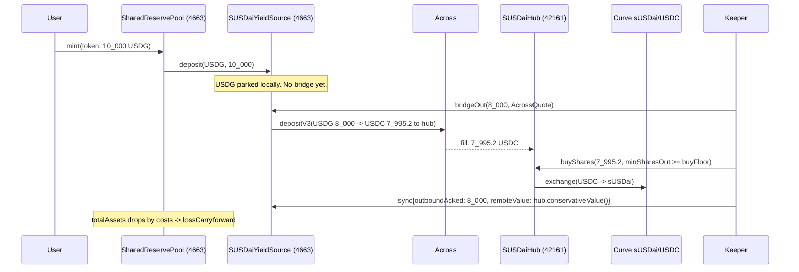
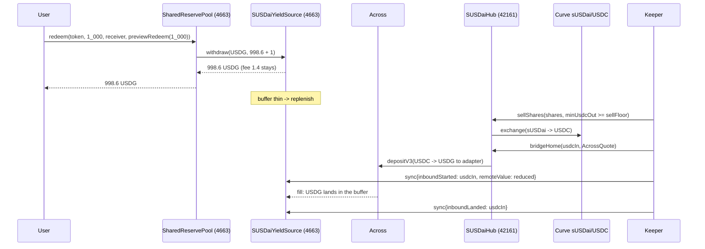

# sUSDai collateral — the cross-chain reserve group

Status: the public integration stack is deployed on Base Sepolia and Arbitrum Sepolia. The source
hashes, transaction receipts, controlled Across round trip, and final accounting are recorded in
[`deployments/asset-markets-base-sepolia.json`](../deployments/asset-markets-base-sepolia.json).
The Robinhood mainnet/Arbitrum mainnet production topology described below is not deployed.
Research and rationale:
[research/SUSDAI_CROSS_CHAIN_ISSUANCE_2026-09-13.md](research/SUSDAI_CROSS_CHAIN_ISSUANCE_2026-09-13.md).

## 1. What it is

In the production design, a second `SharedReservePool` on Robinhood Chain — "the sUSDai group" — whose `IYieldSource` is
not a lending market on this chain but a position on Arbitrum: USD.AI's sUSDai, held by a hub
contract there and reached through Across. Everything a reader of
[SHARED_RESERVE_POOL.md](../SHARED_RESERVE_POOL.md) already knows still holds: brands register
permissionlessly, mint is 1:1 in USDG, brand tokens swap 1:1 with each other, yield goes to brand
treasuries on a cumulative index, and redemption is never pausable. What changes is what the pool
sees behind `yieldSource.balanceOf(USDG)`: instead of Morpho shares it is a USDG buffer on this
chain plus three counters a keeper maintains — USDG in flight out, USDC in flight back, and the
hub's conservatively marked holdings. The bridge and swap costs of moving backing across show up
as `lossCarryforward`; a redemption fee (planned 14 bps, capped at 100) is what repays them; NAV
growth beyond that is yield to the brands exactly as before.

This is a deliberate narrowing of the research document. That document's executive decision is
to keep the *liability* on Arbitrum and bridge our own token to Robinhood (§1). We instead keep
the liability here, where the reserve and every other brand already are, and move only the
*collateral*, because the pool, its ledger, its beacons and its guard already exist on this chain
and a second issuance stack on Arbitrum would duplicate all of it. From §3 we follow the "retail
convenience path": USDG in, bridge to USDC, local tight-bound Curve acquisition, conservative
valuation, deposit-in-progress kept separate from credited backing. From §4 we implement flow B,
the quoted hub market sale, and leave A (market maker), C (native queue) and D (in-kind) for
later. From §7 we keep the mutually exclusive buckets — local, outbound in flight, hub value,
inbound in flight — and its rule that a bridge timeout is a refund to the sender, never equity.
What §3 calls the capital margin is not implemented; the conservative NAV mark and the fee are
the only cushions. See §9 for the full list of deferrals.

## 2. The loop





## 3. Contracts

| Contract | File | Chain | Role | Owner | Keeper rails |
|---|---|---|---|---|---|
| `SharedReservePool` (group proxy) | `src/pool/SharedReservePool.sol` | 4663 | The reserve, the ledger, the redemption fee | Timelock `0x5f43…872a` | none |
| `SUSDaiYieldSource` | `src/yield/SUSDaiYieldSource.sol` | 4663 | USDG buffer, `bridgeOut`, `sync`, position accounting | Timelock | `bridgeOut`, `sync` |
| `SUSDaiHub` | `src/susdai/SUSDaiHub.sol` | 42161 | Holds USDC and sUSDai, swaps on Curve, `bridgeHome` | `HUB_OWNER` (hot key or multisig; the timelock is on the other chain) | `buyShares`, `sellShares`, `bridgeHome` |
| `AcrossBridger` | `src/susdai/AcrossBridger.sol` | both | Shared `depositV3` base: fixed tokens, chain and recipient; keeper supplies the quote | — | — |
| `IAcrossSpokePool`, `ICurveStableSwapNG`, `IStakedUSDai` | `src/interfaces/` | — | The slices of the three external contracts we call | — | — |
| `SUSDaiAddresses` | `script/SUSDaiAddresses.sol` | — | Constants for both chains, read back 2026-09-13 | — | — |

The live brand-token and treasury beacons from the v4 deployment are reused, so a brand registered
on this pool runs the same `PooledBrandToken`/`PoolBrandTreasury` code as the USDG group and
upgrades with it. The market stack is shared rather than duplicated: one `AssetMarketFactory`,
one `MarketRouter` and one `ProtocolFeeHook` serve every reserve the factory has approved, and a
market records which reserve its brand draws on. So a coin backed by this group launches with
its pool in one `createMarket` call, the same as a USDG-group coin, and both groups' markets
share one id space. What differs is the peg's cost, not the plumbing: minting here is bounded by
`liabilityCap`, redemption retains `redemptionFeeBps` and is paid out of the local buffer.

## 4. Accounting

**The position identity.** `adapter.balanceOf(USDG)`, which is what `pool.totalAssets()` adds to
its own idle balance, is

```
position = usdg.balanceOf(adapter) + outboundInFlight + inboundInFlight + remoteValue
```

Only the first term is a balance this chain can read. `bridgeOut` moves USDG from the first term
to the second; a `sync` with `outboundAcked` moves it from the second into whatever `remoteValue`
the keeper reports; `inboundStarted` moves it from `remoteValue` into `inboundInFlight`; and
`inboundLanded` retires `inboundInFlight` because the USDG is now, physically, in the first term.
The keeper can only ever *move* value between buckets or *lower* it; raising it is bounded (below).

**Costs become `lossCarryforward`, fees repay it.** When the keeper syncs a `remoteValue` that is
lower than the USDG it acknowledges — 8,000 USDG out, 7,995.2 USDC delivered, 7,990 conservative
value after the Curve leg — `totalAssets()` drops, and the pool's next `_accrueGlobal` books the
drop into `lossCarryforward`. No brand sees a negative index; the loss is simply the first thing
future growth must cover. The redemption fee is that growth. From `_redeem`:

```solidity
uint256 fee = amount * redemptionFeeBps / BPS;
uint256 owed = amount - fee;
_recallIfNeeded(owed);
...
_syncAccrualBaseline();
if (fee > 0) {
    // The fee stayed in the reserve. Holding it out of the baseline is what makes the
    // next accrual recognise it as income: it repays `lossCarryforward` first and only
    // then reaches the brands' ledgers, the same path yield takes.
    lastAccrualAssets -= Math.min(lastAccrualAssets, fee);
    emit RedemptionFeeRetained(token, fee);
}
```

The fee is not transferred anywhere. It stays in the reserve, the baseline is lowered by it, and
the next accrual sees `totalAssets() - lastAccrualAssets = fee`, which `_accrueGlobal` applies to
`lossCarryforward` first and only then to `cumulativeYieldPerToken`. Test:
`test_redeem_feeRepaysBookedCostsBeforeItBecomesYield`.

**The growth cap.** A `sync` may set

```
remoteValue' + inboundStarted <= remoteValue + outboundAcked + inboundRefunded
                                + remoteValue * maxRemoteGrowthBpsPerDay * elapsed / (10_000 * 1 days)
```

or it reverts `RemoteValueAboveCap(reported, allowed)`. `elapsed` is the time since the last sync
(the first sync gets no growth term). Decreases are unbounded. `outboundRefunded` adds nothing to
the cap because that USDG is back in the local balance, where the pool can already see it.
`inboundStarted` is on the left because value moving from `remoteValue` into `inboundInFlight`
is still value the keeper is asserting exists. At the default 50 bps/day a stolen key can inflate
the position by at most 0.5 % per day beyond what was really bridged, and every wei of that shows
up as claimable brand yield, which is the only thing inflation buys.

**The +1 wei recall.** `SharedReservePool._recallIfNeeded` asks the yield source for
`shortfall + 1`, a habit inherited from Morpho's floor-division rounding. `SUSDaiYieldSource.withdraw`
pays `min(amount, local)`, so after a redemption one wei more than needed sits idle in the pool.
It is not lost: `totalAssets()` counts it, `_syncAccrualBaseline` absorbs it, and the next `mint`
or `deployIdle` sends it back to the adapter. Tests assert on
`adapter.availableLiquidity() + usdg.balanceOf(pool)`, never on the adapter alone.

**The conservative mark and the parity assumption.** `hub.conservativeValue()` is
`sharesHeld * redemptionSharePrice / 1e30 + usdcHeld`, in USDC units: shares are marked at what a
native sUSDai redemption would be serviced at, not the deposit NAV Curve prices them at. The gap
was ~44 bps on 2026-09-13. The keeper reports this number as `remoteValue`, in what the adapter
calls USDG units — that is, USDai, USDC and USDG are all taken at par. Nothing measures that
basis; it is a disclosed assumption, and a USDC/USDG or USDai/USDC depeg is a loss the pool would
only see when the keeper's next sync reports a lower Curve realisation.

**What `previewRedeem` promises and what `minAssetsOut` does.** `previewRedeem(amount)` is
`amount - amount * redemptionFeeBps / 10_000`: the payout when the reserve can deliver in full.
`redeem(token, amount, receiver, minAssetsOut)` burns first, pays `min(owed, idle after recall)`,
and reverts `InsufficientPayout(payout, minimum)` if that is below `minAssetsOut`. A redeemer who
passes `previewRedeem(amount)` gets par-less-fee or nothing; one who passes 0 (the three-argument
overload) accepts whatever the buffer holds and eats the difference as a shortfall that retires
`lossCarryforward` rather than being owed back. Note for integrators: compute `previewRedeem` into a
local before any `vm.prank`/impersonation in tests, because the prank is consumed by the view
call.

## 5. Keeper responsibilities

The keeper is one hot key, set on both contracts, and a service (`services/susdai-keeper/`).
Every call it makes is bounded on chain (§6); its job is timing and reporting.

**Mint side (USDG has accumulated in the adapter).**

1. Fetch an Across quote for `amount` USDG → USDC, depositor = adapter, recipient = hub (see the
   API call below).
2. `adapter.bridgeOut(amount, quote)`. Reverts unless the caller is keeper or owner, the guard has
   not paused the adapter, `amount <= local`, `local - amount >= position * minLocalBufferBps / 10_000`,
   and `quote.outputAmount >= amount - amount * maxBridgeFeeBps / 10_000`. Emits `Bridged` and
   `BridgedOut(depositId, amount, outputAmount)`; `outboundInFlight += amount`.
3. Wait for the fill: poll `usdc.balanceOf(hub)` on Arbitrum, or watch the Arbitrum SpokePool's
   fill event for `depositId`. Expected fill time was ~2 s when measured.
4. `hub.buyShares(usdcIn, minSharesOut)` with `minSharesOut = max(hub.buyFloor(usdcIn), hub.quoteBuy(usdcIn) * (1 - tolerance))`.
   Reverts `MinOutBelowFloor` if `minSharesOut < buyFloor`.
5. `adapter.sync({remoteValue: hub.conservativeValue(), outboundAcked: amount, outboundRefunded: 0, inboundStarted: 0, inboundLanded: 0, inboundRefunded: 0})`.

**Replenish side (buffer below target, or a redemption reverted `InsufficientPayout`).**

1. Choose `shares` such that `hub.quoteSell(shares)` covers the shortfall.
2. `hub.sellShares(shares, minUsdcOut)` with `minUsdcOut >= hub.sellFloor(shares)`.
3. Fetch an Across quote for `usdcIn` USDC → USDG, depositor = hub, recipient = adapter.
4. `hub.bridgeHome(usdcIn, quote)`. Delivers only USDG, only to `homeReceiver`, only on 4663.
5. `adapter.sync({remoteValue: hub.conservativeValue(), inboundStarted: usdcIn, ...})`. Mind the
   cap here: a sale *raises* `conservativeValue()`, because shares that were marked at the
   redemption NAV become USDC at roughly the deposit NAV — the ~44 bps gap is realised as a
   conservative-terms gain. If `conservativeValue() + usdcIn` exceeds `allowed`, report
   `remoteValue = allowed - usdcIn` (under-reporting is always admissible) and let the next
   periodic syncs catch up as the pro-rata growth term accrues. The keeper service must do this.
6. When the USDG lands (it simply appears in `usdg.balanceOf(adapter)`; there is no callback),
   `adapter.sync({remoteValue: hub.conservativeValue(), inboundLanded: usdcIn, ...})`.

**Periodic NAV sync.** At least daily, and more often than `maxRemoteGrowthBpsPerDay` needs it to
be: `adapter.sync({remoteValue: hub.conservativeValue(), everything else 0})`. sUSDai's NAV rises a
few bps a day; the cap is 50, so a sync that has been missed for a week still fits, but the
brands' yield is stale until it lands, and `remoteValueUpdatedAt` is what monitoring watches.

**Refunds.** A deposit nobody fills by `fillDeadline` is refunded by Across's next root bundle,
in the input token, to the depositor, on the origin chain.

- Outbound refund: USDG reappears in `usdg.balanceOf(adapter)`. Sync `outboundRefunded: amount`
  with `remoteValue` unchanged. The cap gives no credit for it; none is needed, the USDG is local.
- Inbound refund: USDC reappears in `usdc.balanceOf(hub)`. Sync `inboundRefunded: usdcIn` and
  `remoteValue: hub.conservativeValue()` (which now includes that USDC again); the cap credits
  `inboundRefunded` so the report is admissible.

**The Across API call.** No key is needed today; Across documents an integrator onboarding
process and the keeper should carry an integrator id once one is issued.

```
GET https://app.across.to/api/swap/approval?tradeType=exactInput&amount=<6dec>&inputToken=<addr>&originChainId=<id>&outputToken=<addr>&destinationChainId=<id>&depositor=<addr>&recipient=<addr>&slippage=0.001
```

| `AcrossQuote` field | Source in the response |
|---|---|
| `outputAmount` | `steps.bridge.outputAmount` |
| `exclusiveRelayer` | abi-decode `swapTx.data` (the SpokePool's `deposit(bytes32,…)`, selector `0xad5425c6`; same twelve words as the `depositV3` our contracts call), arg 8 |
| `quoteTimestamp` | same decode, arg 9 |
| `fillDeadline` | same decode, arg 10 |
| `exclusivityDeadline` | same decode, arg 11 |

The SpokePool rejects a `quoteTimestamp` older than `depositQuoteTimeBuffer()` (3600 s) and a
`fillDeadline` beyond `getCurrentTime() + fillDeadlineBuffer()` (21600 s), so fetch the quote
immediately before sending. Observed cost ~6 bps each way, `expectedFillTime` ~2 s.

## 6. Trust and limits

**Two keys.** The timelock (48 h, `0x5f43E1e732c7aBdbbC73F9d1367320D9040C872a`) owns the pool and
the adapter and is the only thing that can change a limit, rotate the keeper, or set the fee. The
hub's owner is a separate key on Arbitrum — the timelock cannot act there — and should be a
multisig; it can pause the hub, rotate its keeper, change its limits and `homeReceiver`. The
keeper is a hot key with no custody: it can move value between the protocol's own contracts and
report, and nothing else.

**The owner can also replace the code.** The pool, the adapter and the hub are UUPS proxies, so
every bound in the table below is enforced by an implementation their owner can swap. On the
Base Sepolia integration that swap is a single transaction from the deployer, by policy; on a
mainnet deployment it is whatever that stack's owner is, which is the argument for that owner
being a timelock or a multisig rather than one hot key. Read the table as "what the deployed
code enforces against the keeper", not as "what cannot be changed".

| Bound | Contract | Default | Cap | Enforced on | Error |
|---|---|---|---|---|---|
| `maxBridgeFeeBps` | adapter | 20 | 100 | `bridgeOut` quote floor | `BridgeOutputBelowFloor(outputAmount, floor)` |
| `minLocalBufferBps` | adapter | 1 000 (10 %) | 10 000 | `bridgeOut` | `LocalBufferBreached(remaining, required)` |
| `maxRemoteGrowthBpsPerDay` | adapter | 50 | 10 000 | `sync` | `RemoteValueAboveCap(reported, allowed)` |
| `maxSwapSlippageBps` | hub | 50 | 500 | `buyShares`/`sellShares` min-out | `MinOutBelowFloor(minOut, floor)` |
| `maxBridgeFeeBps` | hub | 20 | 100 | `bridgeHome` quote floor | `BridgeOutputBelowFloor` |
| `redemptionFeeBps` | pool | 0 (planned 14) | 100 | every `redeem` | `FeeTooHigh(feeBps, maximum)` on set |

**Pause semantics.**

- `ProtocolGuard` (guardian may pause instantly; only the timelock may unpause) stops
  `pool.mint`, `pool.swap`, `pool.claimYield`, `pool.deployIdle` and `adapter.bridgeOut`. Pausing
  halts new exposure and yield payouts, not exits.
- `pool.redeem` has no pause. Holders can always exit against whatever the buffer holds, and
  `withdraw` on the adapter never reverts.
- `hub.pause()` (hub owner) stops `buyShares`, `sellShares` and `bridgeHome`. Views keep
  answering, so `sync` keeps working: a paused hub must not blind the reserve.

**What a compromised keeper can do.** Bridge USDG to the hub (only the hub) at a quote within
20 bps, down to the 10 % buffer. Churn USDC and sUSDai through Curve at up to 50 bps below NAV per
leg. Bridge USDC home (only to the adapter). Overstate `remoteValue` by up to 50 bps per day, which
lets brand treasuries claim yield that does not exist, at that rate. Refuse to act, which leaves
the buffer to drain and redemptions to revert for anyone passing `minAssetsOut`.

**What it cannot do.** Send any token anywhere but the two protocol contracts. Take a quote below
the fee floor. Sell below the NAV floor. Invent backing faster than the cap. Change a limit, the
fee, or its own successor. Stop a redemption.

## 7. Measured numbers (2026-09-13)

| Quantity | Value |
|---|---|
| Across USDG(4663) → USDC(42161), $10k | 9,993.99 out: ~6 bps |
| Across USDC(42161) → USDG(4663) | ~6 bps |
| Curve `get_dy(USDC→sUSDai, 10_000e6)` | 8,990.84 sUSDai (8,990.80 in the deploy dry run) |
| Curve `get_dy(sUSDai→USDC, 9_000e18)` | 10,007.61 USDC |
| Fork probe, same block | 10,000 USDC → 8,990.81 sUSDai → sell → 9,998.000002 USDC: **2 bps round trip** |
| `conservativeValue()` right after that buy | 9,954.76 USDC (deposit NAV 1.112174e18, redemption NAV 1.107215e18: **~44 bps gap**) |

So a full USDG → USDC → sUSDai → USDC → USDG round trip costs 6 + 2 + 6 = 14 bps, which is the
fee default. It is a cost recovery, not a margin: every redemption pays exactly the friction it
will eventually cause, and the pool's accounting nets the two to zero over time. The 44 bps NAV
gap is *not* charged — it is a valuation haircut the pool carries as `lossCarryforward` from the
first sync, is repaid by sUSDai's own NAV growth as the keeper syncs it, and would be
realised only if the position had to exit through the native queue. Raising the fee toward the
100 bps cap to cover it would make every redeemer pay for a loss that is not expected to happen.

## 8. Runbook

### Base Sepolia integration deployment

The deployed test topology uses `script/DeployArbitrumSepoliaSUSDaiMock.s.sol`,
`script/DeployBaseSepoliaPlatform.s.sol`, and `script/SeedBaseSepoliaPlatform.s.sol`. It replaces
production USDG with Circle test USDC, uses real Across and canonical Base Sepolia Uniswap v4,
and replaces only the unavailable Arbitrum sUSDai/Curve venue with deterministic mocks. Treat the
manifest as the address and receipt authority; the commands below remain the production runbook.

### Production deployment

Step 1, Arbitrum. Dry run first, then broadcast. `HUB_OWNER` and `SUSDAI_KEEPER` default to the
deployer.

```bash
PRIVATE_KEY=0x... forge script script/DeploySUSDaiHub.s.sol --rpc-url https://arb1.arbitrum.io/rpc
```

```bash
PRIVATE_KEY=0x... HUB_OWNER=<multisig> SUSDAI_KEEPER=<keeper> forge script script/DeploySUSDaiHub.s.sol --rpc-url https://arb1.arbitrum.io/rpc --broadcast --slow
```

Step 2, Robinhood. Takes the hub address. The four governance addresses are the live v4 values.

```bash
PRIVATE_KEY=0x... SUSDAI_HUB=<hub> SUSDAI_KEEPER=<keeper> TIMELOCK=0x5f43E1e732c7aBdbbC73F9d1367320D9040C872a PROTOCOL_GUARD=0x88eeA21D246DF8aa4Ca071532cB06d4f66D45f65 BRAND_TOKEN_BEACON=0xc7433cD04Ce4B5b326602EFeD3bBA68d29aC4Bde TREASURY_BEACON=0x8AB0789D62a06546bfF51Be28ecaC696eb817897 forge script script/DeploySUSDaiGroup.s.sol --rpc-url https://rpc.mainnet.chain.robinhood.com
```

```bash
PRIVATE_KEY=0x... SUSDAI_HUB=<hub> SUSDAI_KEEPER=<keeper> TIMELOCK=0x5f43E1e732c7aBdbbC73F9d1367320D9040C872a PROTOCOL_GUARD=0x88eeA21D246DF8aa4Ca071532cB06d4f66D45f65 BRAND_TOKEN_BEACON=0xc7433cD04Ce4B5b326602EFeD3bBA68d29aC4Bde TREASURY_BEACON=0x8AB0789D62a06546bfF51Be28ecaC696eb817897 forge script script/DeploySUSDaiGroup.s.sol --rpc-url https://rpc.mainnet.chain.robinhood.com --broadcast --slow
```

Step 3, point the hub at the adapter (hub owner key, Arbitrum):

```bash
cast send <hub> 'setHomeReceiver(address)' <adapter> --rpc-url https://arb1.arbitrum.io/rpc --private-key $PRIVATE_KEY
```

Step 4, schedule the fee. The pool is owned by the timelock from birth, so this is a governance
call with the full 48 h delay. `<salt>` is any bytes32; use the same one in both calls.

```bash
cast send 0x5f43E1e732c7aBdbbC73F9d1367320D9040C872a 'schedule(address,uint256,bytes,bytes32,bytes32,uint256)' <pool> 0 $(cast calldata 'setRedemptionFee(uint16)' 14) 0x0000000000000000000000000000000000000000000000000000000000000000 $(cast keccak 'susdai-group-fee-1') 172800 --rpc-url https://rpc.mainnet.chain.robinhood.com --private-key $PRIVATE_KEY
```

```bash
cast send 0x5f43E1e732c7aBdbbC73F9d1367320D9040C872a 'execute(address,uint256,bytes,bytes32,bytes32)' <pool> 0 $(cast calldata 'setRedemptionFee(uint16)' 14) 0x0000000000000000000000000000000000000000000000000000000000000000 $(cast keccak 'susdai-group-fee-1') --rpc-url https://rpc.mainnet.chain.robinhood.com --private-key $PRIVATE_KEY
```

```bash
cast call <pool> 'redemptionFeeBps()(uint16)' --rpc-url https://rpc.mainnet.chain.robinhood.com
```

Step 5, start the keeper only once that reads 14. Until then the group is fee-free and every
round trip is a cost the group eats; USDG minted in the window sits in the adapter's buffer
untouched, which is safe. See `services/susdai-keeper/` for the service and its env.

### Monitoring

```bash
cast call <adapter> 'availableLiquidity()(uint256)' --rpc-url https://rpc.mainnet.chain.robinhood.com
cast call <adapter> 'outboundInFlight()(uint256)' --rpc-url https://rpc.mainnet.chain.robinhood.com
cast call <adapter> 'inboundInFlight()(uint256)' --rpc-url https://rpc.mainnet.chain.robinhood.com
cast call <adapter> 'remoteValue()(uint256)' --rpc-url https://rpc.mainnet.chain.robinhood.com
cast call <adapter> 'remoteValueUpdatedAt()(uint64)' --rpc-url https://rpc.mainnet.chain.robinhood.com
cast call <pool> 'totalAssets()(uint256)' --rpc-url https://rpc.mainnet.chain.robinhood.com
cast call <pool> 'totalPooledSupply()(uint256)' --rpc-url https://rpc.mainnet.chain.robinhood.com
cast call <pool> 'lossCarryforward()(uint256)' --rpc-url https://rpc.mainnet.chain.robinhood.com
cast call <pool> 'redemptionFeeBps()(uint16)' --rpc-url https://rpc.mainnet.chain.robinhood.com
cast call <hub> 'sharesHeld()(uint256)' --rpc-url https://arb1.arbitrum.io/rpc
cast call <hub> 'usdcHeld()(uint256)' --rpc-url https://arb1.arbitrum.io/rpc
cast call <hub> 'conservativeValue()(uint256)' --rpc-url https://arb1.arbitrum.io/rpc
```

Invariants to alert on: `totalAssets() >= totalPooledSupply` (solvency, as for every group);
`availableLiquidity() >= position * minLocalBufferBps / 10_000` outside a replenish window;
`remoteValueUpdatedAt` older than a day; `remoteValue` on the adapter diverging from
`conservativeValue()` on the hub by more than a day's NAV drift; `lossCarryforward` growing
without a corresponding bridge.

### Failure modes

| Symptom | What happened | What to do |
|---|---|---|
| Fill never lands; `outboundInFlight` stuck | No relayer filled by `fillDeadline` | Wait for Across's refund bundle; USDG reappears in the adapter; sync `outboundRefunded`. Then re-quote. |
| `bridgeHome` fill never lands | Same, on the way back | USDC reappears in the hub; sync `inboundRefunded` and refreshed `remoteValue`. |
| Keeper offline | Nothing is reported | `remoteValue` goes stale; brand yield is under-credited, never over. Redemptions keep paying from the buffer until it is empty. Rotate the key via the timelock if it is gone for good. |
| Curve depeg / thin pool | `sellShares` reverts `MinOutBelowFloor` or Curve reverts on min-out | Nothing is sold below NAV-less-50 bps. Governance either raises `maxSwapSlippageBps` (hub owner, cap 500) and takes the realised loss, or waits. The native queue (§9) is the eventual answer. |
| Buffer empty | Redemptions exceeded 10 % between replenishes | `redeem` with `minAssetsOut` reverts `InsufficientPayout`; the three-argument overload pays what is there. Keeper replenishes; redeemers retry. |
| Guard paused | Guardian saw something | `mint`, `swap`, `claimYield`, `deployIdle`, `bridgeOut` halt; `redeem` and `sync` continue. Only the timelock can unpause. |
| `RemoteValueAboveCap` on an honest sync | sUSDai NAV rose faster than 50 bps/day; a `sellShares` realised the ~44 bps NAV gap; or syncs were missed for so long the pro-rata term is still short | Sync at the cap (the report may be lower than the truth) and let the next syncs catch up; or governance raises `maxRemoteGrowthBpsPerDay` with a reason. |

## 9. Deferred

Each of these is a real gap, listed so nobody mistakes the current build for the research
document's full design.

- **Native ERC-7540 queue exit.** `IStakedUSDai` carries `requestRedeem`/`redeem`; the hub does not
  call them. Research §4C is the liquidity fallback for sizes Curve cannot absorb, and needs the
  pending-share and USDai-receivable buckets from §7.
- **USDai → PYUSD primary leg.** Research §6 found `withdraw` on USDai is not gated; a primary
  exit could beat Curve at size. Not wired.
- **Market stack for this group.** No `AssetMarketFactory`, `MarketRouter` or `ProtocolFeeHook`
  points at this pool. Brands registered here are mint/redeem-only.
- **Cross-group conversion.** A USDG-group brand token and an sUSDai-group brand token are not
  swappable; each pool's `swap` is internal.
- **Fee accounting refinements.** The fee is one flat number for every redeemer regardless of
  whether their exit triggers a bridge; a buffer-aware or size-aware fee, and a fee that tracks
  the measured round trip, are both possible and neither is built.
- **Capital margin.** Research §3's junior capital cushion is not implemented; the conservative
  mark and `lossCarryforward` are the only absorbers.
- **Keeper key security.** The keeper is a raw private key in an env var. HSM/KMS signing is the
  obvious next step and changes nothing on chain.
- **Across integrator key.** The API answers without one today; onboarding should happen before
  volume does.
- **Hub owner is not the timelock.** It cannot be, across chains. A multisig on Arbitrum is the
  minimum; cross-chain governance (CCIP, research §2) would let the Robinhood timelock own it.

## 10. Test map

| File | Proves |
|---|---|
| `test/susdai/SUSDaiGroup.t.sol` | End to end with mocks: mint parks USDG; `bridgeOut` escrows and keeps the position whole; fee floor, buffer, keeper gate and pause on `bridgeOut`; `sync` books costs as loss, cannot ack what was not sent, growth cap incl. `inboundStarted`; redeem pays par-less-fee from the buffer, fee repays losses before yield, thin buffer reverts with `minAssetsOut`, redeem after replenish; outbound refund; hub growth reaches a treasury; controller gating; one-shot bind; `setRedemptionFee` owner-only and capped |
| `test/susdai/SUSDaiYieldSource.t.sol` | Adapter in isolation: `withdraw` semantics, `sync` arithmetic and cap edges, limit setters, bridge argument fixing |
| `test/susdai/SUSDaiHub.t.sol` | Hub in isolation: floors, `MinOutBelowFloor`, coin-order discovery, `bridgeHome` fixed recipient/token/chain, pause, keeper/owner gating |
| `test/SharedReservePool.t.sol` (fee section) | `redemptionFeeBps` on the pool alone: `previewRedeem`, `FeeTooHigh`, fee-as-income into `lossCarryforward` then the index |
| `test/susdai/SUSDaiGroupRobinhoodFork.t.sol` | Real USDG, real Robinhood SpokePool: a `bridgeOut` that the live pool accepts, refund accounting |
| `test/susdai/SUSDaiHubArbitrumFork.t.sol` | Real Curve, real sUSDai, real Arbitrum SpokePool: buy/sell round trip, `conservativeValue`, a real `depositV3` |

```bash
forge test --match-path 'test/susdai/*' --no-match-path 'test/*Fork*' -vv
```

```bash
forge test --match-path 'test/susdai/SUSDaiGroupRobinhoodFork.t.sol' --fork-url https://rpc.mainnet.chain.robinhood.com -vv
```

```bash
ARBITRUM_RPC_URL=https://arb1.arbitrum.io/rpc forge test --match-path 'test/susdai/SUSDaiHubArbitrumFork.t.sol' --fork-url https://arb1.arbitrum.io/rpc -vv
```

The Robinhood public RPC is not an archive node; fork tests take the latest block and never pin
an old one. `block.number` on an Arbitrum fork is the L1 block number; nothing asserts on it.
